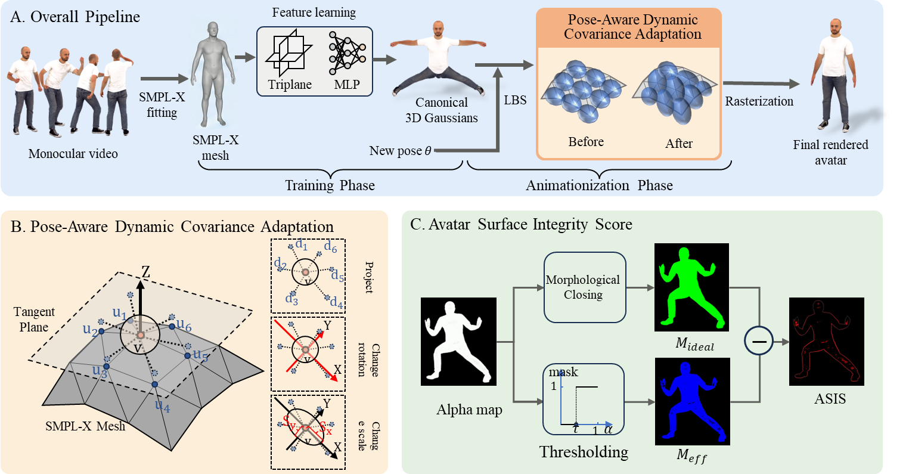
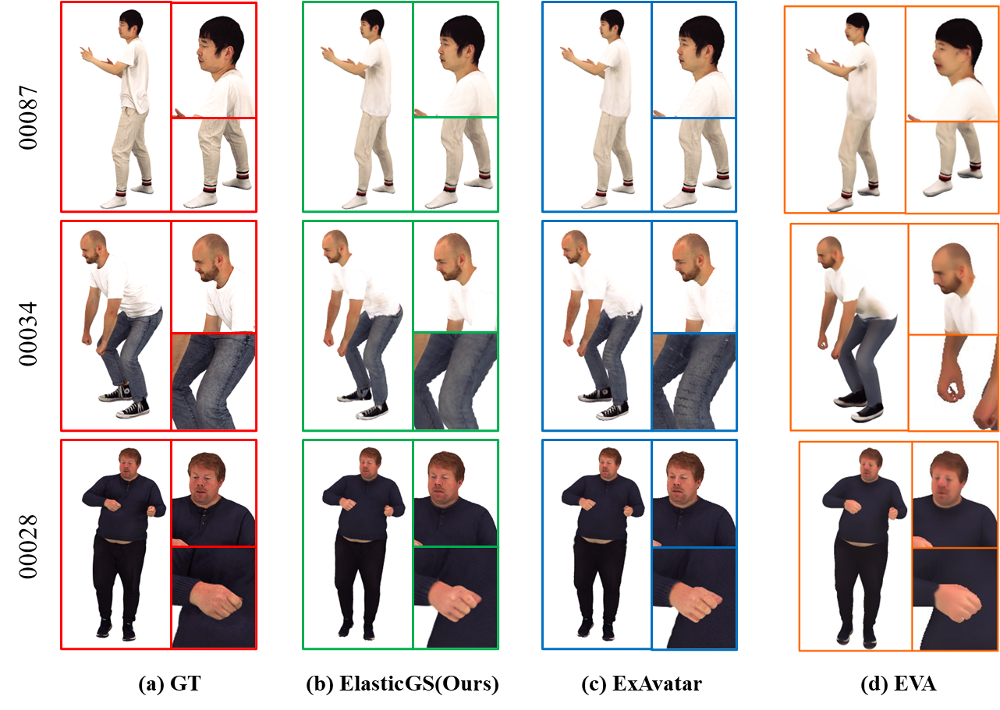

# ElasticGS: Pose-Aware Dynamic 3D Gaussian Splatting for Crack-Free Human Avatar Animation

## Introduction
Animatable and high-fidelity 3D human avatar plays an indispensable role in applications such as metaverse construction, virtual reality interaction, and immersive telepresence. However, existing methods based on 3D Gaussian Splatting (3DGS) often struggle with large-amplitude exercise. Due to the lack of explicit physical coupling between Gaussian primitives and the underlying mesh deformation, these primitives fail to adaptively deform in response to skin stretching. Consequently, this leads to cracks and holes on the avatar surface, significantly compromising visual realism. To address this challenge, we propose a pose aware dynamic 3DGS strategy. The core insight is to leverage the topological structure of the corresponding SMPL-X mesh during avatar motion to perform local Principal Component Analysis(PCA), explicitly calculating the principal stretching direction and magnitude of the surface. This mechanism drives the Gaussian primitives to rotate and scale in real-time during animationization—functioning like elastic ”scales”—to seamlessly fill geometric holes caused by motion. Furthermore, addressing the limitation of existing image quality metrics in quantifying avatar surface integrity, we introduce the Avatar Surface Integrity Score(ASIS). By utilizing morphological masking and a density proxy mechanism, ASIS achieves the first reference-free quantitative evaluation of the integrity on the avatar surface. Experiments on the XHumans and AvatarRex datasets, which contain rich motion sequences, demonstrate that our method significantly reduces the surface hole rate while maintaining high-fidelity texture rendering. 

**Overview of ElasticGS**. (Top) The overall pipeline builds upon ExAvatar but introduces a training-free Pose-Aware Dynamic Covariance
Adaptation method during the animationization phase to eliminate surface cracks. (Bottom Left) Detail of the adaptation module: we perform
PCA on the tangent plane of the deformed mesh to align and scale Gaussian primitives (visualized as ellipsoids) along the principal stretching
direction ($e_1$). (Bottom Right) Illustration of the proposed ASIS metric, which quantifies the hole rate by comparing the ideal morphological
mask ($M_{ideal}$) with the effective density mask ($M_{eff}$) derived from a proxy rendering pass.

## Comparison with the rendering quality of SOTA

## The visualization of ASIS
* The ASIS visualization result in the 00034 object of the XHumans dataset.

The left panel displays the results of ExAvatar, whereas the right panel shows ElasticGS (Ours). Red regions denote cracks or holes.

* The ASIS visualization result in the 00087 object of the XHumans dataset.

The left panel displays the results of ExAvatar, whereas the right panel shows ElasticGS (Ours). Red regions denote cracks or holes.

## Code
Code is coming soon...

